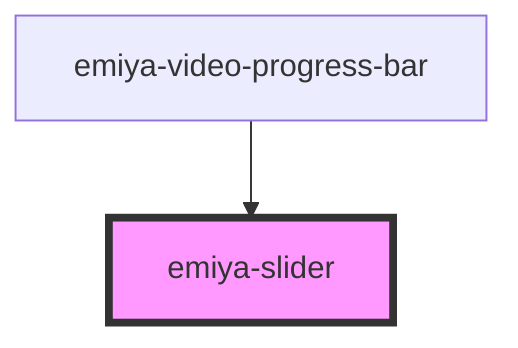

# emiya-slider

<!-- Auto Generated Below -->

## Properties

| Property               | Attribute                 | Description | Type                                | Default                       |
| ---------------------- | ------------------------- | ----------- | ----------------------------------- | ----------------------------- |
| `max`                  | `max`                     |             | `number`                            | `100`                         |
| `min`                  | `min`                     |             | `number`                            | `0`                           |
| `onChange`             | --                        |             | `(value: number) => void`           | `undefined`                   |
| `progressBarBaseColor` | `progress-bar-base-color` |             | `string`                            | `'rgba(255, 255, 255, 0.35)'` |
| `progressBarHeight`    | `progress-bar-height`     |             | `number`                            | `6`                           |
| `progressBarLeftColor` | `progress-bar-left-color` |             | `string`                            | `'#e12617'`                   |
| `realtime`             | `realtime`                |             | `boolean`                           | `true`                        |
| `reverseXY`            | `reverse-x-y`             |             | `boolean`                           | `undefined`                   |
| `shadowProgresses`     | --                        |             | `{ start: number; end: number; }[]` | `[]`                          |
| `slideHandleRadius`    | `slide-handle-radius`     |             | `number`                            | `5`                           |
| `value`                | `value`                   |             | `number`                            | `0`                           |

## Dependencies

### Used by

 - [emiya-video-progress-bar](../emiya-video-progress-bar)

### Graph

----------------------------------------------

*Built with [StencilJS](https://stenciljs.com/)*
