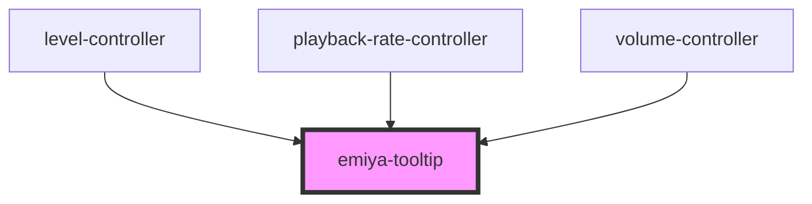

# emiya-tooltip

<!-- Auto Generated Below -->

## Properties

| Property             | Attribute       | Description | Type                   | Default     |
| -------------------- | --------------- | ----------- | ---------------------- | ----------- |
| `boundingElement`    | --              |             | `HTMLElement`          | `undefined` |
| `forceVisible`       | `force-visible` |             | `boolean`              | `undefined` |
| `onVisibilityChange` | --              |             | `(a: boolean) => void` | `undefined` |

## Methods

### `setVisibility(visible: boolean) => Promise<void>`

#### Parameters

| Name      | Type      | Description |
| --------- | --------- | ----------- |
| `visible` | `boolean` |             |

#### Returns

Type: `Promise<void>`

## Dependencies

### Used by

 - [level-controller](../level-controller)
 - [playback-rate-controller](../playback-rate-controller)
 - [volume-controller](../volume-controller)

### Graph

----------------------------------------------

*Built with [StencilJS](https://stenciljs.com/)*
