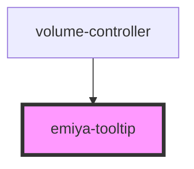

# emiya-tooltip

<!-- Auto Generated Below -->

## Properties

| Property          | Attribute       | Description | Type          | Default     |
| ----------------- | --------------- | ----------- | ------------- | ----------- |
| `boundingElement` | --              |             | `HTMLElement` | `undefined` |
| `forceVisible`    | `force-visible` |             | `boolean`     | `false`     |

## Events

| Event                | Description | Type                   |
| -------------------- | ----------- | ---------------------- |
| `onVisibilityChange` |             | `CustomEvent<boolean>` |

## Dependencies

### Used by

 - [volume-controller](../volume-controller)

### Graph

----------------------------------------------

*Built with [StencilJS](https://stenciljs.com/)*
