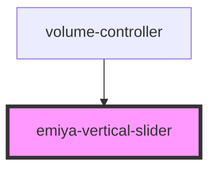

# emiya-vertical-slider

<!-- Auto Generated Below -->

## Properties

| Property               | Attribute                 | Description | Type                      | Default                       |
| ---------------------- | ------------------------- | ----------- | ------------------------- | ----------------------------- |
| `max`                  | `max`                     |             | `number`                  | `100`                         |
| `min`                  | `min`                     |             | `number`                  | `0`                           |
| `onChange`             | --                        |             | `(value: number) => void` | `undefined`                   |
| `onIsDraggingChange`   | --                        |             | `(a: boolean) => void`    | `undefined`                   |
| `progressBarBaseColor` | `progress-bar-base-color` |             | `string`                  | `'rgba(255, 255, 255, 0.35)'` |
| `progressBarLeftColor` | `progress-bar-left-color` |             | `string`                  | `'#e12617'`                   |
| `progressBarWidth`     | `progress-bar-width`      |             | `number`                  | `6`                           |
| `realtime`             | `realtime`                |             | `boolean`                 | `true`                        |
| `slideHandleRadius`    | `slide-handle-radius`     |             | `number`                  | `5`                           |
| `value`                | `value`                   |             | `number`                  | `0`                           |

## Dependencies

### Used by

 - [volume-controller](../volume-controller)

### Graph

----------------------------------------------

*Built with [StencilJS](https://stenciljs.com/)*
