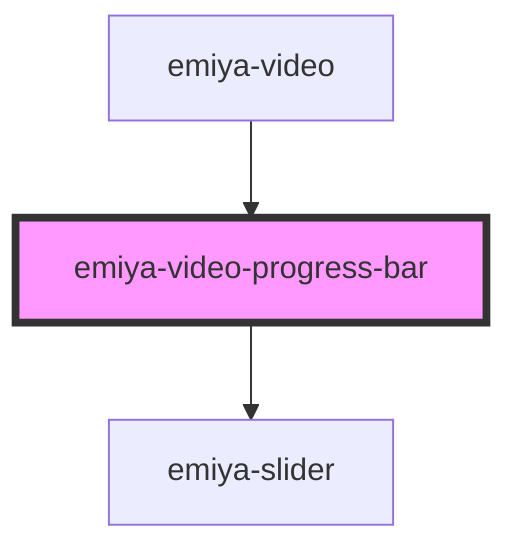

# emiya-video-progress-bar

<!-- Auto Generated Below -->

## Properties

| Property              | Attribute     | Description | Type                  | Default     |
| --------------------- | ------------- | ----------- | --------------------- | ----------- |
| `allowSeek`           | `allow-seek`  |             | `boolean`             | `undefined` |
| `onCurrentTimeChange` | --            |             | `(a: number) => void` | `undefined` |
| `onDurationChange`    | --            |             | `(a: number) => void` | `undefined` |
| `reverseXY`           | `reverse-x-y` |             | `boolean`             | `undefined` |
| `videoRef`            | --            |             | `HTMLVideoElement`    | `undefined` |

## Dependencies

### Used by

 - [emiya-video](../emiya-video)

### Depends on

- [emiya-slider](../emiya-slider)

### Graph

----------------------------------------------

*Built with [StencilJS](https://stenciljs.com/)*
