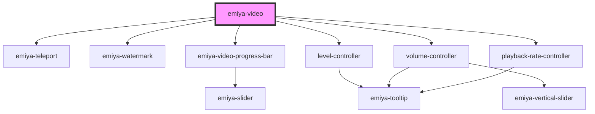

# my-component

<!-- Auto Generated Below -->

## Properties

| Property               | Attribute                 | Description | Type                                                              | Default     |
| ---------------------- | ------------------------- | ----------- | ----------------------------------------------------------------- | ----------- |
| `autoHideControlDelay` | `auto-hide-control-delay` |             | `number`                                                          | `6000`      |
| `autoplay`             | `autoplay`                |             | `boolean`                                                         | `undefined` |
| `debuggable`           | `debuggable`              |             | `boolean`                                                         | `false`     |
| `onCurrentTimeChange`  | --                        |             | `(currentTime: number) => any`                                    | `undefined` |
| `onDurationChange`     | --                        |             | `(duration: number) => any`                                       | `undefined` |
| `onFullScreenChange`   | --                        |             | `(fullScreen: boolean) => any`                                    | `undefined` |
| `onLevelChange`        | --                        |             | `(level: number) => any`                                          | `undefined` |
| `onLevelsChange`       | --                        |             | `(levels: { id: number; name: string; level?: Level; }[]) => any` | `undefined` |
| `onPlaybackRateChange` | --                        |             | `(duration: number) => any`                                       | `undefined` |
| `onStatusChange`       | --                        |             | `(status: VideoStatus, message?: any) => any`                     | `undefined` |
| `onVolumeChange`       | --                        |             | `(volume: number) => any`                                         | `undefined` |
| `seekable`             | `seekable`                |             | `boolean`                                                         | `true`      |
| `src`                  | `src`                     |             | `string`                                                          | `undefined` |
| `watermark`            | `watermark`               |             | `string`                                                          | `undefined` |

## Methods

### `getCurrentTime() => Promise<number>`

#### Returns

Type: `Promise<number>`

### `getDuration() => Promise<number>`

#### Returns

Type: `Promise<number>`

### `getFullScreen() => Promise<boolean>`

#### Returns

Type: `Promise<boolean>`

### `getLevel() => Promise<number>`

#### Returns

Type: `Promise<number>`

### `getLevels() => Promise<{ id: number; name: string; level?: Level; }[]>`

#### Returns

Type: `Promise<{ id: number; name: string; level?: Level; }[]>`

### `getPlaybackRate() => Promise<number>`

#### Returns

Type: `Promise<number>`

### `getStatus() => Promise<VideoStatus>`

#### Returns

Type: `Promise<VideoStatus>`

### `getVolume() => Promise<number>`

#### Returns

Type: `Promise<number>`

### `mute() => Promise<void>`

#### Returns

Type: `Promise<void>`

### `pause() => Promise<void>`

#### Returns

Type: `Promise<void>`

### `play() => Promise<void>`

#### Returns

Type: `Promise<void>`

### `setCurrentTime(time: number) => Promise<void>`

#### Parameters

| Name   | Type     | Description |
| ------ | -------- | ----------- |
| `time` | `number` |             |

#### Returns

Type: `Promise<void>`

### `setFullScreen(value: boolean) => Promise<void>`

#### Parameters

| Name    | Type      | Description |
| ------- | --------- | ----------- |
| `value` | `boolean` |             |

#### Returns

Type: `Promise<void>`

### `setLevel(level: number) => Promise<void>`

#### Parameters

| Name    | Type     | Description |
| ------- | -------- | ----------- |
| `level` | `number` |             |

#### Returns

Type: `Promise<void>`

### `setPlaybackRate(value: number) => Promise<void>`

#### Parameters

| Name    | Type     | Description |
| ------- | -------- | ----------- |
| `value` | `number` |             |

#### Returns

Type: `Promise<void>`

### `setVolume(value: number) => Promise<void>`

#### Parameters

| Name    | Type     | Description |
| ------- | -------- | ----------- |
| `value` | `number` |             |

#### Returns

Type: `Promise<void>`

### `unmute() => Promise<void>`

#### Returns

Type: `Promise<void>`

## Dependencies

### Depends on

- [emiya-teleport](../emiya-teleport)
- [emiya-watermark](../emiya-watermark)
- [emiya-video-progress-bar](../emiya-video-progress-bar)
- [level-controller](../level-controller)
- [volume-controller](../volume-controller)
- [playback-rate-controller](../playback-rate-controller)

### Graph

----------------------------------------------

*Built with [StencilJS](https://stenciljs.com/)*
