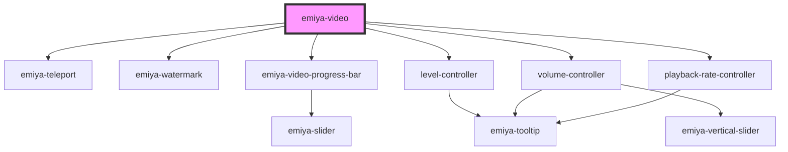

# my-component

<!-- Auto Generated Below -->

## Properties

| Property               | Attribute                 | Description | Type     | Default     |
| ---------------------- | ------------------------- | ----------- | -------- | ----------- |
| `autoHideControlDelay` | `auto-hide-control-delay` |             | `number` | `6000`      |
| `src`                  | `src`                     |             | `string` | `undefined` |

## Dependencies

### Depends on

- [emiya-teleport](../emiya-teleport)
- [emiya-watermark](../emiya-watermark)
- [emiya-video-progress-bar](../emiya-video-progress-bar)
- [level-controller](../level-controller)
- [volume-controller](../volume-controller)
- [playback-rate-controller](../playback-rate-controller)

### Graph

----------------------------------------------

*Built with [StencilJS](https://stenciljs.com/)*
