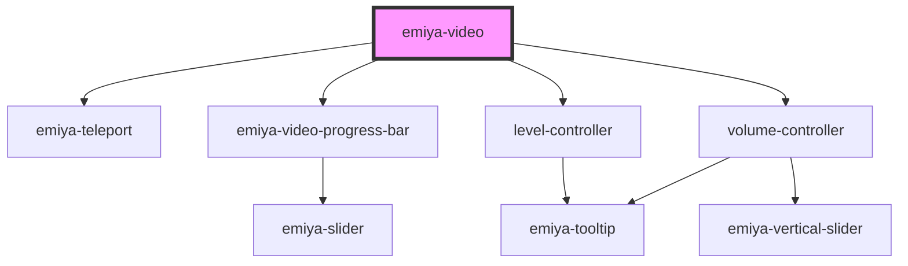

# my-component

<!-- Auto Generated Below -->

## Properties

| Property | Attribute | Description | Type     | Default     |
| -------- | --------- | ----------- | -------- | ----------- |
| `src`    | `src`     |             | `string` | `undefined` |

## Dependencies

### Depends on

- [emiya-teleport](../emiya-teleport)
- [emiya-video-progress-bar](../emiya-video-progress-bar)
- [level-controller](../level-controller)
- [volume-controller](../volume-controller)

### Graph

----------------------------------------------

*Built with [StencilJS](https://stenciljs.com/)*
