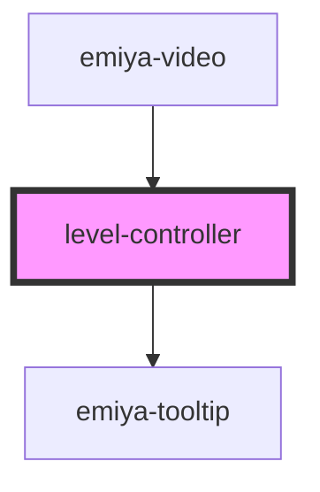

# level-controller

<!-- Auto Generated Below -->

## Properties

| Property   | Attribute | Description | Type                                             | Default     |
| ---------- | --------- | ----------- | ------------------------------------------------ | ----------- |
| `auto`     | `auto`    |             | `boolean`                                        | `undefined` |
| `onChange` | --        |             | `(value: number) => any`                         | `undefined` |
| `options`  | --        |             | `{ id: number; name: string; level?: Level; }[]` | `[]`        |
| `value`    | `value`   |             | `number`                                         | `undefined` |

## Dependencies

### Used by

 - [emiya-video](../emiya-video)

### Depends on

- [emiya-tooltip](../emiya-tooltip)

### Graph

----------------------------------------------

*Built with [StencilJS](https://stenciljs.com/)*
