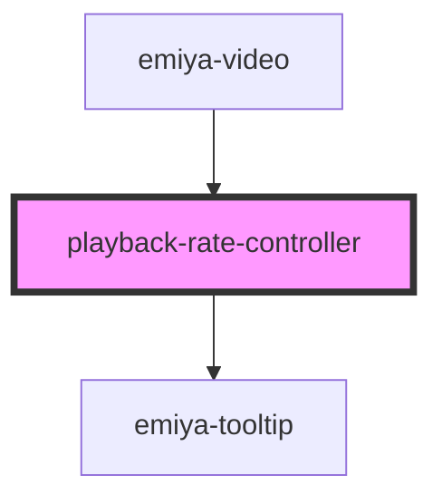

# playback-rate-controller

<!-- Auto Generated Below -->

## Properties

| Property   | Attribute | Description | Type               | Default     |
| ---------- | --------- | ----------- | ------------------ | ----------- |
| `videoRef` | --        |             | `HTMLVideoElement` | `undefined` |

## Dependencies

### Used by

 - [emiya-video](../emiya-video)

### Depends on

- [emiya-tooltip](../emiya-tooltip)

### Graph

----------------------------------------------

*Built with [StencilJS](https://stenciljs.com/)*
