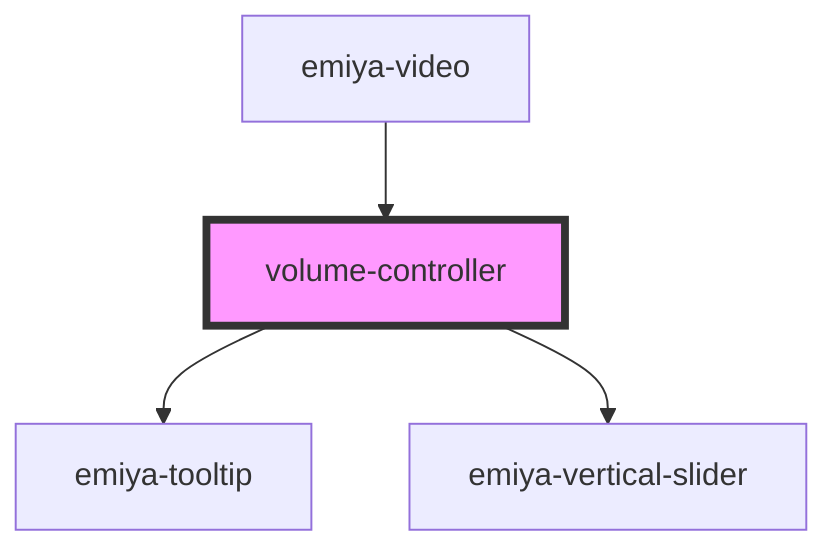

# volume-controller

<!-- Auto Generated Below -->

## Properties

| Property    | Attribute     | Description | Type                     | Default     |
| ----------- | ------------- | ----------- | ------------------------ | ----------- |
| `onChange`  | --            |             | `(value: number) => any` | `undefined` |
| `reverseXY` | `reverse-x-y` |             | `boolean`                | `undefined` |
| `videoRef`  | --            |             | `HTMLVideoElement`       | `undefined` |

## Dependencies

### Used by

 - [emiya-video](../emiya-video)

### Depends on

- [emiya-tooltip](../emiya-tooltip)
- [emiya-vertical-slider](../emiya-vertical-slider)

### Graph

----------------------------------------------

*Built with [StencilJS](https://stenciljs.com/)*
